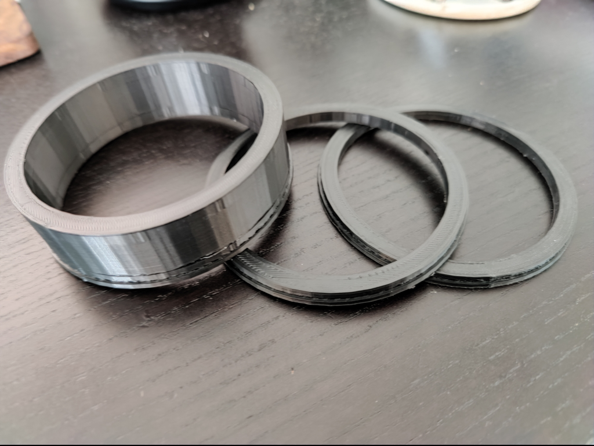
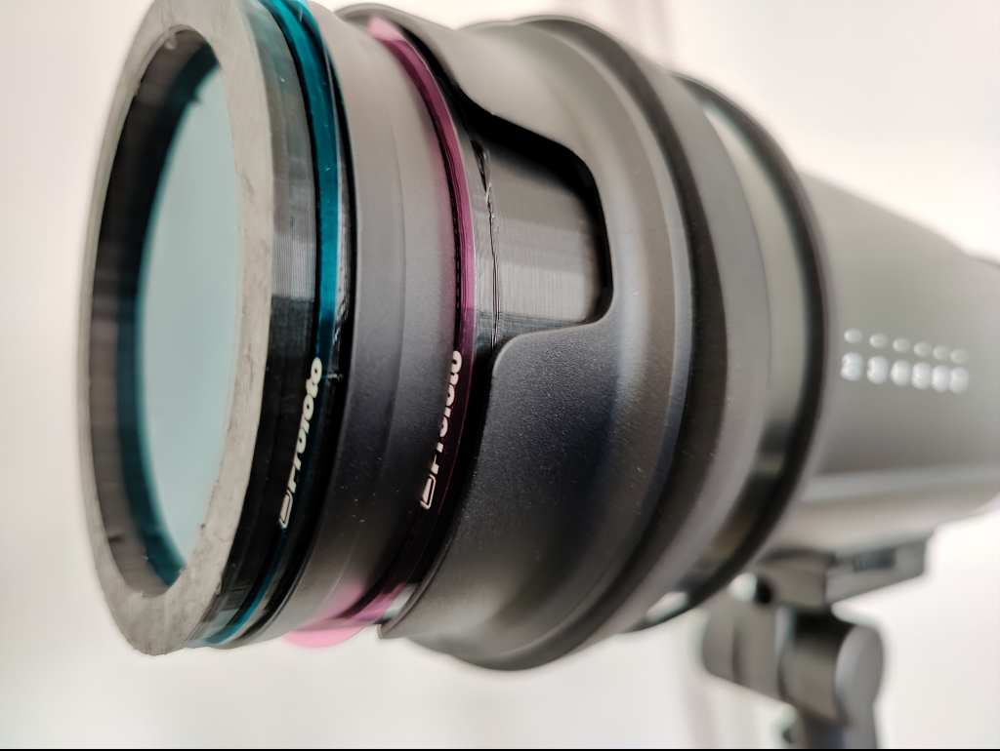
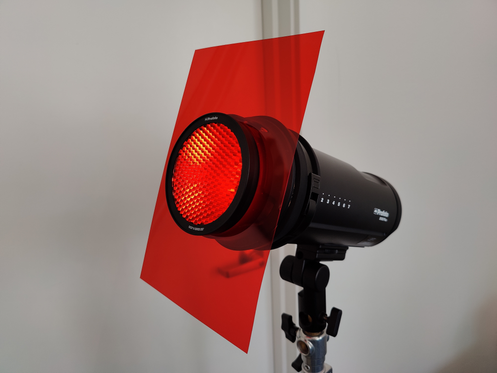
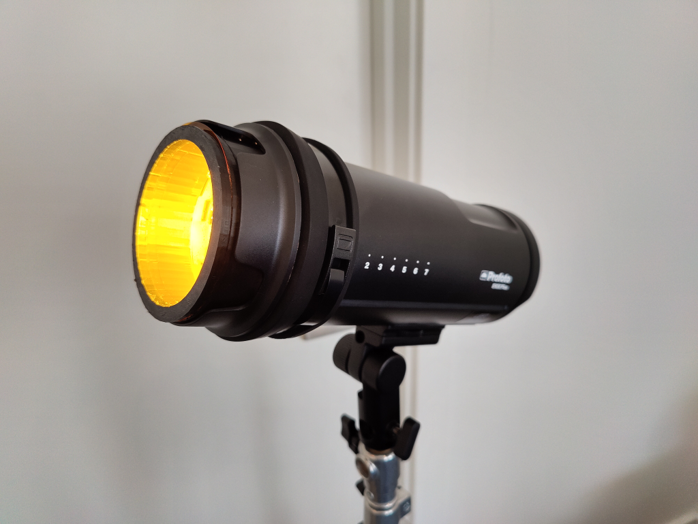
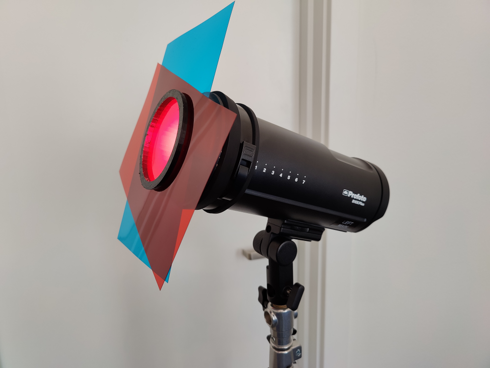
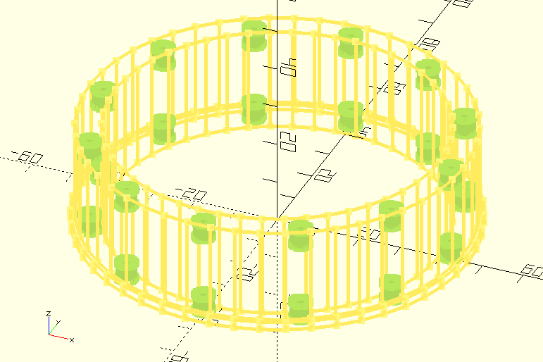

# Parametric Profoto OCF II Magnetic Gel Clamps

## And OCF I to OCF II Gel Adapter

These gel-retainer rings have cavities for print-in magnets that line up with the magnets in Profoto's official OCF II stackable gel and grid accessories, so you can use arbitrary gels with your Profoto strobe heads without having to use an OCF II Gel Ring adapter, and without cutting your gels.

You can use these to attach a single gel with no other modifiers, multiple gels, or combine it with official OCF II gels and grids.

Also allows you use your existing OCF I gels without cutting or modifying them.

## Customizing And Printing

I recommend using a heat-tolerant material such as ABS.

I used 4x2 mm disc magnets, stacked in pairs - a total of 24 magnets for the rings, and 48 for the riser. I recommend using rare earth neodynium magnets if you're planning on having additional accessories stacked on top of these.

I sourced them from:  https://www.apexmagnets.com/magnets/4mm-x-2mm-disc-neodymium-magnets

If you have a different size of magnet, or don't want to stack them, you can change `mag_dia` and `mag_depth` accordingly, though anything greater than 4mm in diameter will require thicker walls.

Configure your slicer to pause the job at the appropriate layers to print the magnets in, or change the `mag_bury` parameter to 0 to leave the magnet cavities exposed so you can glue them in after printing.

You can set `test_fit=true` in the clamp to print a small test part to ensure your magnets fit correctly.

## Use

To use these, you'll still need one of Profoto's OCF II magnetic mounting adapters - either the "OCF II Gel & Grid Holder" or "OCF II Barndoor" - though I've only tested fit with the former.

Clamp your gels between two of these rings, or between one ring and an official accessory like a magnetic grid.

Use the riser to attach larger gels that won't fit inside the speedring adapter built into the Profoto Gel Adapter. If you're using at least two official OCF II gels or grids, they'll be deep enough that you won't need the riser.

 